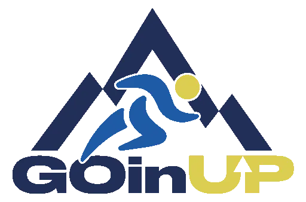
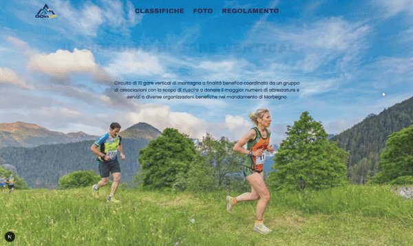

  
  

    <i>Step behind the scenes of the <a href="https://goinupvertical.it" target="_blank">GOinUP Vertical website</a>.</i>
  

   
  

---

## Introduzione  
GOinUP è un gruppo di associazioni che coordina e promuove l'omonimo circuito di gare di montagna il cui obbiettivo è quello di riuscire a supportare e donare attrezzature ad organizzazioni benefiche nel mandamento di Morbegno.

Data la premessa, il progetto nasce con un principio guida molto semplice:
> **Ogni euro speso in infrastruttura è un euro sottratto alla causa.**

Da qui derivano una serie di scelte architetturali che permettono di vivere interamente nei *free tier* dei servizi utilizzati, senza compromessi sulla qualità dell'esperienza utente.

### Wordpress
Un'obiezione che potrebbe sorgere spontanea potrebbe essere: *"Con 3€ al mese prendi un hosting Wordpress e non ci pensi più"*.

La risposta breve è che essendo un progetto *pro bono* ed avendo sempre sviluppato in Angular ho colto l'occasione per prendere familiarità con React, Next.js ed i servizi utilizzati.

Quella lunga dovrebbe parlare di alcuni requisiti tecnici che avrebbero probabilmente richiesto l'acquisto di plugin (ho poi sviluppato un [plugin](https://github.com/matteogadola/wp-racemate) dedicato).

## Stack Tecnologico
Next.js, TailwindCSS, Sanity, Supabase, Stripe, Brevo.

## Architettura

### **Frontend**  
- Next.js con rendering ibrido (SSG + ISR) per ridurre le chiamate ai servizi esterni.  
- TailwindCSS per uno stile modulare e veloce.

### **Backend-as-a-Service**  
- Nessun server custom.  
- Tutta la logica delegata a Sanity e Supabase.  
- Zero manutenzione, zero costi, zero rischi.

### **Deployment**  
- Deploy su Vercel (free tier).  
- Build ottimizzate e caching automatico.

